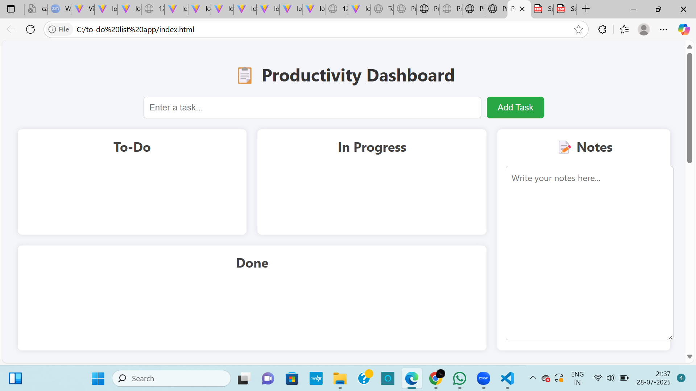

# 🧠 Productivity Dashboard

A responsive and interactive productivity dashboard built using **HTML**, **CSS**, and **JavaScript** — no frameworks!

🎯 [Live Demo](http://sailaja-todolistapp.netlify.app/)

---

## ✨ Features

- ✅ To-Do Board with **To Do**, **In Progress**, and **Done** columns
- 📒 Notes section to jot down ideas
- 📅 Daily Planner (Morning / Afternoon / Evening)
- ⏱️ Pomodoro Timer for focused work sessions
- 📊 Visual Progress Tracker
- 📱 Fully responsive for mobile and desktop

---

## 📸 Preview

---

## 🚀 Tech Stack

- HTML5
- CSS3
- JavaScript (Vanilla)

---

## 🌐 Deployment

Deployed using **Netlify**  
🔗 [Live Site](http://sailaja-todolistapp.netlify.app/)

---

## 🙋‍♀️ Author

**Sailaja Patneedi**  
🎓 Final Year CSE Student | 🤖 AI/ML Enthusiast  
🔗 [LinkedIn](https://www.linkedin.com/in/sailaja-patneedi-786a6a295)  
💻 GitHub: [@yourusername](https://github.com/yourusername)

---

## 📄 License

This project is open source under the [MIT License](LICENSE).

